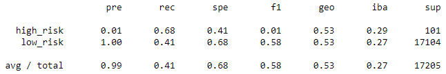
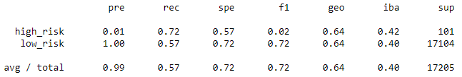

# Credit Risk Analysis

## Overview
Credit risk is an inherently unbalanced classification problem, as good loans easily outnumber risky loans. Therefore, different techniques will be employed to train and evaluate models with unbalanced classes. 

## Results

* Balanced accuracy is 0.65; average precision and recall scores are 0.99 and 0.61, respectively.

* Balanced accuracy is 0.66; average precision and recall scores are 0.99 and 0.69, respectively. 

* Balanced accuracy is 0.55; average precision and recall scores are 0.99 and 0.41, respectively.

* Balanced accuracy is 0.64; average precision and recall scores are 0.99 and 0.57, respectively.

* Balanced accuracy is 1.00; weighted average precision and recall scores are 1.00 and 1.00, respectively.

* Balanced accuracy is 0.93; average/total precision and recall scores are 0.99 and 0.94, respectively.

## Summary
The machine learning models shown above have varying results, mostly on the balanced accuracy score and the precision and recall scores. The Balanced Random Forest Classifier appears to be recommended due to having a balanced accuracy of 1.00.